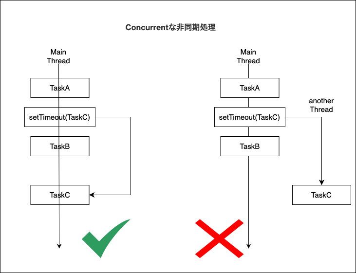
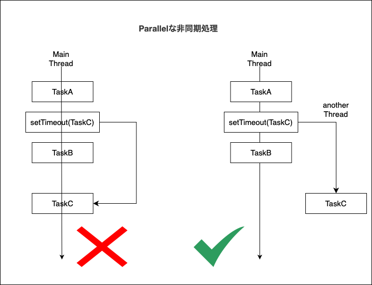
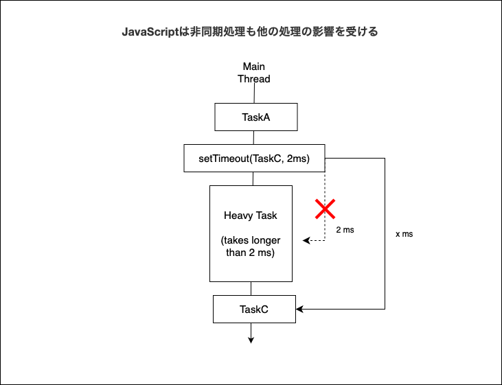

### Async

- 非同期処理

---

### JavaScriptはメインスレッドしかない

- JavaScriptの非同期処理は別スレッドを切るのではなく、メインスレッドにて並行処理(Concurrent)で行われる

    *Concurrentな処理とは複数の処理を切り替えながら処理することで、複数のタスクを扱える処理方法



上記例ではTaskAの後にsetTimeoutで非同期処理の関数を呼んでおり**プログラム上ではxミリ秒後に別スレッドでコールバック関数が実行されているように感じる**が、<font color="red">実際はxミリ秒後にsetTimeoutに渡したコールバック関数をメインスレッドで実行するようにタイマーへ登録している</font>

<br>

- 一方で、Javaの非同期処理は別スレッドを切って処理される並列処理(Parallel)で行われる

    *JavaScriptでもウェブアプリケーション作成に利用できるWeb Workerという仕組みを利用すればJavaScriptでも並列処理ができる



---

### JavaScriptの非同期処理での問題

- 非同期処理は後続の処理の影響を受ける
    - 重い処理はその後続の処理をブロックするので、非同期処理の開始も同様にブロックされる



- 非同期処理自体が重かった場合、その後続の処理がブロックされる
    - その場合、非同期処理中はユーザーは画面の操作ができない(ブロックされる)ので、"システムが固まった?"と不安にさせてしまうので注意

---

### 非同期処理と例外処理

- 下記のコードにおいて、catchは非同期処理でのエラーはキャッチしない
    - setTimeoutでタイマー登録した後、try句を抜け、後続処理に入っていってしまうから   

```js
try {
    setTimeout(() => {
        throw new Error("Error");
    }, 1000);
} catch (error) {
    console.log("Error occures!");
}

// 後続処理
```

<br>

- 非同期処理中に起きたエラーは非同期処理ないでキャッチする必要がある

```js
setTimeout(() => {
    try {
        throw new Error("Error");
    } catch (error) {
        console.log("Error occures!");
    }
}, 1000);

// 後続処理
```
